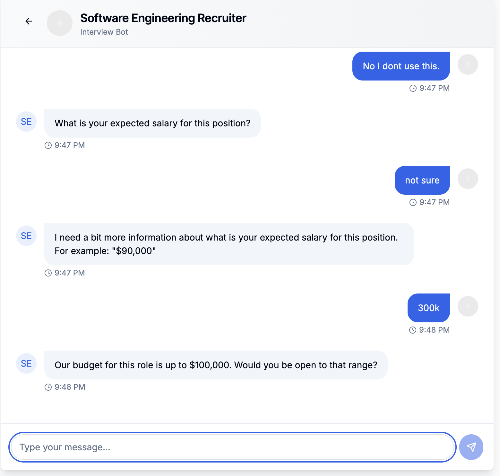
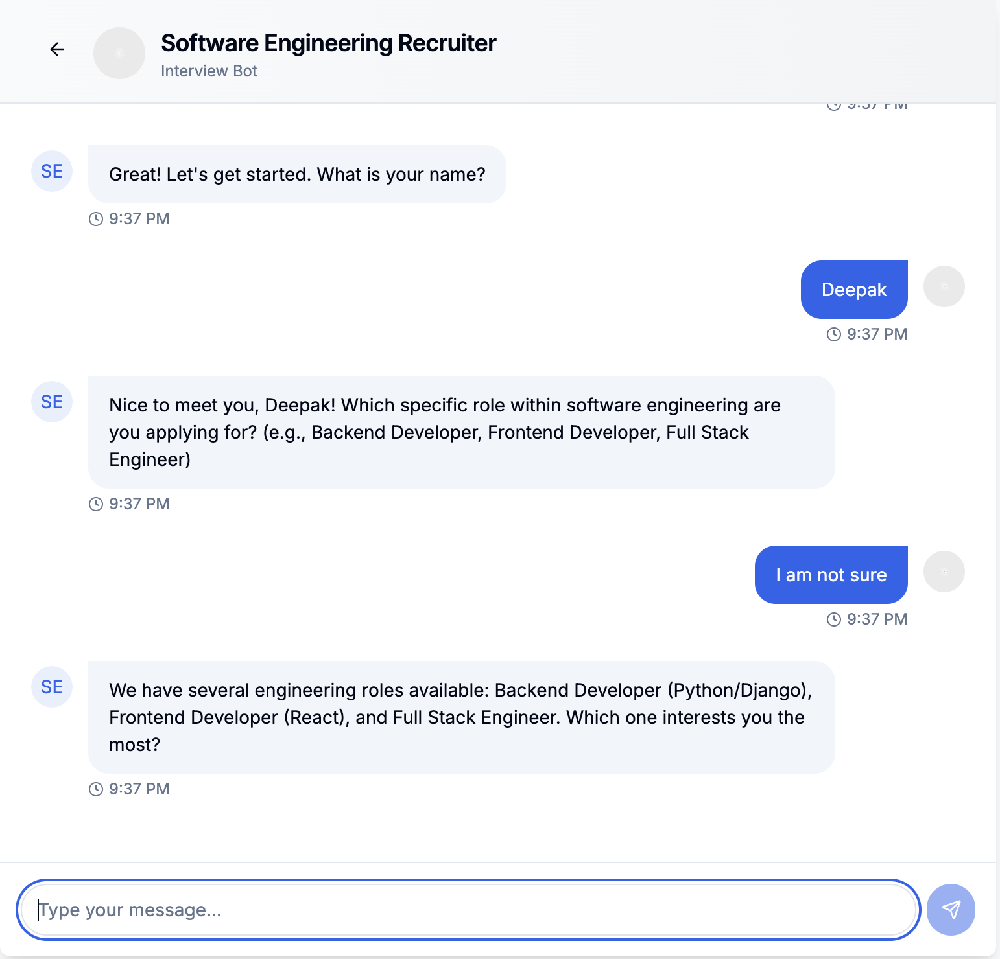
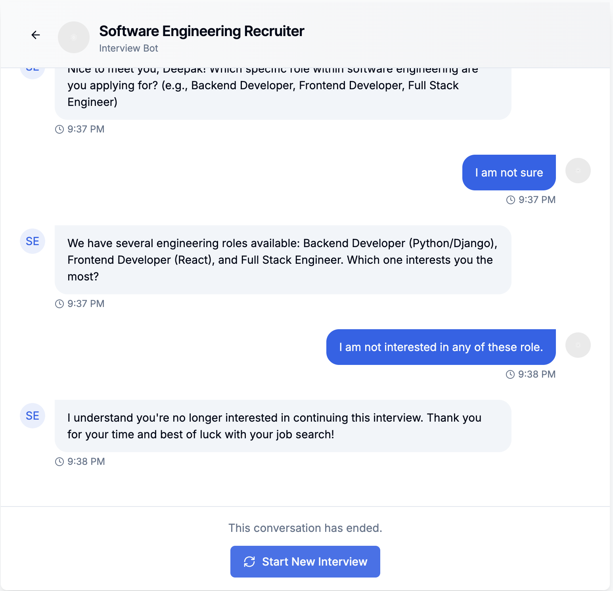

# Interview Chatbot

An AI-powered interview chatbot that simulates a software engineering interview. The chatbot follows a predefined script but uses AI to understand and respond to user inputs intelligently.

## Features

- Structured interview flow with branching logic  
- AI-powered response analysis using OpenAI's GPT models  
- Ability to skip questions based on user experience  
- Conversation history storage  
- Responsive UI with typing indicators  
- Fallback mechanisms when AI is unavailable  

## Prerequisites

- Node.js 18+ installed  
- npm or yarn package manager  
- OpenAI API key  

## Installation

1. **Clone the repository:**

   ```bash
   git clone https://github.com/yourusername/interview-chatbot.git
   cd interview-chatbot
   ```

2. **Install dependencies:**

   ```bash
   npm install --force
   ```

3. **Create a `.env.local` file in the root directory with your OpenAI API key:**

   ```env
   OPENAI_API_KEY=your_openai_api_key_here
   ```

## Running the Application

### Development Mode

Run the development server:

```bash
npm run dev
```

Open [http://localhost:3000](http://localhost:3000) in your browser to see the application.

### Production Build

Build the application for production:

```bash
npm run build
```

Start the production server:

```bash
npm start
```

## How It Works

### Architecture

- **Frontend**: React components with Next.js App Router  
- **Backend**: Next.js API routes  
- **AI Integration**: OpenAI GPT models via server-side API calls  
- **Storage**: Client-side localStorage for interview data  

### Interview Flow

- The chatbot follows a script defined in `lib/script-loader.ts`  
- User responses are analyzed using pattern matching and AI  
- The chatbot adapts the interview flow based on user responses  
- Interview history is saved in localStorage  

### AI Integration

The application uses OpenAI's GPT models for:

- **Response Analysis**: Understanding user responses to determine the next question  
- **Question Answering**: Providing informative answers when users ask questions  

All AI calls are made server-side via a Next.js API route to keep your API key secure.

## Customization

### Modifying the Interview Script

- The interview script is defined in `lib/script-loader.ts`  
- Modify the `softwareEngineerScript` object to change questions, add new branches, or build new flows  

### Changing the Job Description

- Update the job description in `data/jobs/software-engineer.json` to match your specific job requirements  

## Troubleshooting

### OpenAI API Issues

- Verify your API key is correct in `.env.local`  
- Check if you have sufficient credits in your OpenAI account  
- Look for rate limiting messages in the console  

### Browser Storage Issues

- Ensure localStorage is enabled in your browser  
- Clear browser storage and try again  
- Check the browser console for storage-related errors  

---

## Design Decisions

### Architecture

1. **Script Engine**  
   - Implemented as a state machine with nodes and branches  
   - Each interview question is a node with defined response types and branching logic  
   - Allows flexible interview flows that adapt to candidate responses  

2. **Storage Layer**  
   - Used client-side localStorage for persistence  
   - Followed a service-based approach to abstract storage operations  
   - Makes it easy to replace with server-side storage in the future  

3. **AI Integration**  
   - Created a two-tier analysis system:  
     - **Primary**: OpenAI for natural language understanding  
     - **Fallback**: Rule-based pattern matching for reliability  
   - Ensures the system works even if AI service is temporarily unavailable  

4. **UI Components**  
   - Used `shadcn/ui` for consistent, accessible components  
   - Implemented a familiar chat-based interface  
   - Added animations and typing indicators for a more natural feel  

---

## Assumptions

### User Experience

- Users prefer a conversational interface over form-based interviews  
- Typing indicators and animations simulate human-like interaction  
- Users expect the ability to review past interviews  

### Technical

- Application will be run on modern browsers  
- Users have stable internet connections  
- Interview sessions are expected to be under an hour  
- Local storage is sufficient for data persistence  

### Interview Process

- Covers backend, frontend, and full-stack roles  
- Includes relevant questions on Python and React  
- Also assesses salary expectations and cultural fit  

### AI Capabilities

- OpenAI can reliably extract structured information from natural responses  
- AI can detect when to skip questions based on experience  
- Fallback logic is required for AI unavailability scenarios  

---

## Interesting Technical Tidbits

### Dynamic Question Skipping

The system can skip questions dynamically based on candidate responses:

1. Detects lack of experience via keyword analysis  
2. Determines the next relevant question category  
3. Skips irrelevant sections smoothly  
4. Provides seamless user experience  

```typescript
// Example of logic for skipping React questions
if (nodeId === "react-rating" && isNoExperienceResponse) {
  return {
    nextNodeId: "debugging-approach",
    endConversation: false,
    needsFollowUp: false,
  }
}
```

### Prompt Engineering for Structured Data

Extracting structured information required carefully crafted prompts:

```typescript
const analysisPrompt = `
You are analyzing a candidate's response during a software engineering interview.

Current question: "${currentNode.message}"
Candidate's response: "${userResponse}"

Based on the response, please extract the following information in JSON format:
{
  "relevance": 0-10,
  "clarity": 0-10,
  "extractedInfo": {
    ${nodeId === "name" ? '"name": "extracted name",' : ""}
    "hasNoExperience": boolean,
    "shouldSkipCategory": boolean
  }
}

IMPORTANT: Return ONLY the raw JSON object without any markdown formatting.
`
```

### Thinking State Simulation

A "thinking" delay was added for more human-like behavior:

```typescript
// Show thinking state with a minimum duration
setIsThinking(true)
const minThinkingTime = Math.random() * 1000 + 1500 // 1.5-2.5 seconds

const timer = setTimeout(() => {
  setIsThinking(false)
}, minThinkingTime)

setThinkingTimer(timer)
```


## Future Improvements

With additional time, I would consider implementing:

1. Server-side storage for interview data persistence
2. More sophisticated response analysis with fine-tuned models
3. Integration with applicant tracking systems
4. Additional interview templates for different roles
5. Analytics dashboard for interview metrics


## 📸 Screenshots

### Chatbot UI


### Dynamic Interview Flow


### Early Exit

